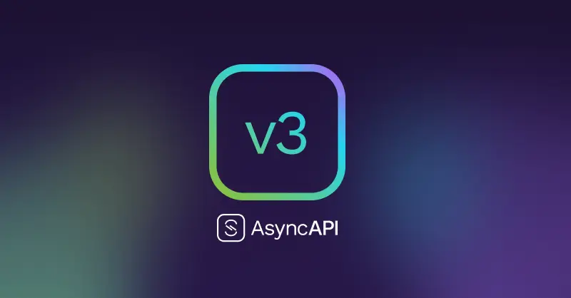

# AsyncAPI 3.0.0 Release Notes

The new version of the AsyncAPI specification - 3.0.0 - is now available and is packed with goodies! Some clear up confusion, some add features, and others improve maintainability.



<!-- truncate -->
To make the information as clear as possible, we have split up the information into digestible chunks.

If you want to get an overview of:

- All the changes done in v3, you are in the right place!
- Migration guide for all the breaking changes between v2 and v3

## Overview

This post will give you an overview of all the changes done in v3.

### Operation, channel, and message decoupling

In v2, it has never been possible to re-use channels, because it was directly coupled with operations of an application.

In v3, this is now possible, with the mindset that a channel and message should be detached from the operations performed. This means for any message broker, for example, for Kafka, channels now ONLY define topics and the messages it contains. For REST interfaces, it's all the paths and corresponding messages across all request types. For WebSocket, it's all the messages flowing through the WebSocket server. For Socket.Io, it defines all the rooms and messages therein.

This change makes the channels reusable across multiple AsyncAPI documents.

```yaml
asyncapi: 3.0.0
...
channels:
  UserSignup:
    address: user/signedup
    messages: 
      UserMessage: 
        payload:
          type: object
          properties:
            displayName:
              type: string
              description: Name of the user
operations:
  ConsumeUserSignups:
    action: receive
    channel: 
      $ref: "#/channels/UserSignup"
